# 💻 Portifólio — Leonardo Martins Macedo 👨‍💻

> [!NOTE]
> Um portfólio que é um **notebook 3D**: o visitante clica, a tampa abre, o sistema liga e a câmera entra na tela. Lá dentro há um **sistema operacional próprio** — barra de menu, dock e janelas —, em que cada seção do portfólio é um app, com um **assistente de IA** que responde sobre o autor e abre apps sozinho.

<table>
  <tr>
    <td width="800px">
      <div align="justify">
        Este repositório contém o <b>Portifólio</b>, desenvolvido no <b>Laboratório 01</b> da disciplina <i>Desenvolvimento e Integração de Aplicações Web</i> (DIAW) do curso de <b>Engenharia de Software da PUC Minas</b>. Feito com <b>React + Vite</b>, <b>Three.js (React Three Fiber)</b> e <b>Vercel Functions</b>, ele tem versão para celular, português e inglês, tema claro e escuro, dados ao vivo do <b>Spotify</b> e do <b>WakaTime</b>, formulário de contato com <b>EmailJS</b> e um <b>assistente de IA</b> (Google Gemini via AI SDK, no plano gratuito) com ferramentas que agem no próprio sistema.
      </div>
    </td>
    <td>
      <div align="center">
        
      </div>
    </td>
  </tr>
</table>

---

## 🚧 Status do Projeto


[](https://github.com/leonardoMartins-Dev/Portifolio-Pessoal/actions/workflows/ci.yml)

---

## 📚 Índice

- [Links Úteis](#-links-úteis)
- [Sobre o Projeto](#-sobre-o-projeto)
- [Funcionalidades Principais](#-funcionalidades-principais)
- [Tecnologias Utilizadas](#-tecnologias-utilizadas)
  - [Dependências](#-dependências)
- [Arquitetura](#-arquitetura)
  - [Rotas](#rotas)
  - [Decisões de design](#-decisões-de-design)
- [Wireframes](#-wireframes)
- [Instalação e Execução](#-instalação-e-execução)
  - [Pré-requisitos](#pré-requisitos)
  - [Variáveis de Ambiente](#-variáveis-de-ambiente)
  - [Instalação de Dependências](#-instalação-de-dependências)
  - [Como Executar a Aplicação](#-como-executar-a-aplicação)
- [Guias de configuração das integrações](#-guias-de-configuração-das-integrações)
  - [Assistente de IA: Google Gemini + Upstash](#-assistente-de-ia-google-gemini--upstash)
  - [Spotify](#-spotify)
  - [WakaTime](#️-wakatime)
  - [GitHub](#-github)
  - [EmailJS](#-emailjs)
- [Como adicionar um certificado](#-como-adicionar-um-certificado)
- [Deploy](#-deploy)
- [Estrutura de Pastas](#-estrutura-de-pastas)
- [Demonstração](#-demonstração)
- [Testes](#-testes)
- [Documentações utilizadas](#-documentações-utilizadas)
- [Autores](#-autores)
- [Contribuição](#-contribuição)
- [Agradecimentos](#-agradecimentos)
- [Licença](#-licença)

---

## 🔗 Links Úteis

- 🌐 **Demo Online:** _em breve_ <!-- TODO: link do deploy na Vercel -->
  > 💻 **Descrição:** aplicação publicada na Vercel (plano Hobby), com Preview automático a cada Pull Request.
- 📖 **Especificação:** [`docs/PROJETO.md`](docs/PROJETO.md)
  > 📚 **Descrição:** requisitos, arquitetura, identidade visual e plano de execução por fases — a fonte de verdade do projeto.
- 🎤 **Roteiro da apresentação:** [`docs/apresentacao.md`](docs/apresentacao.md)

---

## 📝 Sobre o Projeto

**Por que existe.** É o Laboratório 01 de DIAW (Engenharia de Software, PUC Minas): um portfólio profissional com Sobre (PT/EN), Projetos em linha do tempo, Experiências, Contato com formulário funcional, design responsivo e hospedagem gratuita na nuvem.

**O que o diferencia.** Em vez de uma página com seções, o portfólio é uma experiência:

1. **Entrada 3D** — a mesa de trabalho do autor: notebook, luminária, livros, currículo, celular e objetos pessoais (boneco do Luffy, raquete de tênis, quadro do Galo). Cada objeto é um atalho para um app; no clique, o notebook abre, a tela acende e a câmera entra até a tela cobrir a janela, já na **tela de bloqueio**.
2. **Sistema operacional próprio** — barra de menu, dock e janelas que se arrastam, redimensionam, minimizam e maximizam. Identidade própria: inspirado em laptops modernos, sem copiar nenhum sistema existente.
3. **Assistente de IA com ferramentas** — responde sobre o autor e sobre o sistema e **executa ações**: abre apps, mostra um projeto específico, troca idioma e tema.
4. **Dados ao vivo** — música tocando agora (Spotify), horas programando na semana (WakaTime) e atividade no GitHub (contribuições, repositórios e commits).
5. **Celular** — abaixo de 768px o sistema vira uma interface de telefone, com os mesmos apps.

**Para quem.** Recrutadores, professores e colegas que querem conhecer o autor de forma rápida e memorável.

---

## ✨ Funcionalidades Principais

- 💻 **Intro 3D:** a mesa de trabalho do autor (noite no tema escuro, dia no claro), com objetos clicáveis que abrem apps e um notebook que abre, liga e leva a câmera para dentro da tela. Pulável, acessível por teclado e desativada com movimento reduzido ou sem WebGL.
- 🔒 **Tela de bloqueio:** relógio, foto, nome e "Entrar" (sem senha; clique ou qualquer tecla), notificação do assistente e "Bloquear" no menu do logo.
- 🪟 **Gerenciador de janelas:** abrir saindo do dock, focar, arrastar, redimensionar, minimizar para o dock, maximizar (ou clique duplo no título) e fechar. Cada app é único e tem rota própria.
- 🖥️ **Área de trabalho:** ícones de todos os apps à esquerda (clique duplo ou Enter abre) e GitHub/LinkedIn à direita.
- 📱 **Versão mobile:** tela inicial com perfil, widgets, grade de apps e dock; apps em tela cheia; o Voltar do navegador fecha o app.
- 🌐 **PT/EN:** rotas `/pt` e `/en`; a troca mantém o app aberto (`/pt/projects` ↔ `/en/projects`).
- 🌗 **Tema claro, escuro ou do sistema**, 4 papéis de parede originais.
- 🙋 **Sobre:** apresentação, formação, foco atual, objetivos e "Fora do código" (One Piece, tênis e Galo, os mesmos objetos da mesa 3D).
- 🗂️ **Projetos em linha do tempo**, do mais recente ao mais antigo, com um botão que inverte para a ordem do mais antigo ao mais recente, com tecnologias, GitHub, demo, imagem/GIF/vídeo, filtro por tecnologia e `?project=` para destacar um projeto. Demos em plano gratuito (o WaveHub, no Render) são **acordadas assim que o app abre**, para o servidor já estar ligado no clique em Demo.
- 💼 **Experiências** com tipo, período ("mar 2024 – atual") e filtro.
- 🏅 **Certificados:** cursos concluídos do mais recente ao mais antigo, com prévia, emissor, data, carga horária, PDF para ver ou baixar e link de verificação (o QR code do certificado). Para adicionar um novo, veja [Como adicionar um certificado](#-como-adicionar-um-certificado).
- 📨 **Contato:** e-mail (com copiar), WhatsApp, LinkedIn e GitHub + formulário validado (Zod) que envia dois e-mails pelo EmailJS.
- 🤖 **Assistente de IA** em streaming, com markdown, sugestões, Ctrl/⌘K, limite de uso e ferramentas no cliente.
- 🎵 **Spotify** (tocando agora, recentes, top + mini player na barra de menu), ⏱️ **WakaTime** (horas na semana, por dia e por linguagem) e 🐙 **GitHub** (gráfico de contribuições do último ano, repositórios recentes e últimos commits; funciona sem chave).
- ⌨️ **Terminal** com comandos PT/EN, histórico (↑/↓) e autocompletar (Tab) — homenagem ao portfólio-terminal do professor.
- ♿ **Acessibilidade:** navegação completa por teclado, foco visível, `role="dialog"`, rótulos traduzidos, contraste AA e `prefers-reduced-motion`.

### Requisitos da disciplina e onde são atendidos

| Requisito do PDF                                               | Onde está no projeto                                                                             |
| -------------------------------------------------------------- | ------------------------------------------------------------------------------------------------ |
| Menu de navegação                                              | Dock, barra de menu, ícones do desktop e assistente. No celular: grade de apps e dock            |
| Cabeçalho / rodapé / área de conteúdo                          | Barra de menu (topo, `<header>`) / dock com créditos (base, `<footer>`) / janelas (`<main>`)     |
| Estrutura de páginas e links entre seções                      | Cada app tem rota própria (`/{locale}/{appId}`); deep links funcionam                            |
| Sobre Mim em PT e EN                                           | App **Sobre** + troca PT/EN na barra de menu e em Ajustes                                        |
| Projetos em linha do tempo, do mais antigo ao mais recente     | App **Projetos**: timeline por data; o botão "Mais antigos" mostra essa ordem (com teste)        |
| Projeto: nome, descrição, tecnologias, link GitHub, imagem/GIF | Card de projeto (mídia com lazy-load e texto alternativo traduzido)                              |
| Experiências: empresa, cargo, período, descrição               | App **Experiências**                                                                             |
| Contato: ícones clicáveis (e-mail, WhatsApp, LinkedIn…)        | App **Contato** + atalhos no desktop                                                             |
| Formulário (nome, e-mail, mensagem) com envio por e-mail       | App **Contato**: React Hook Form + Zod + EmailJS (dois templates)                                |
| Validações básicas                                             | Zod com mensagens traduzidas                                                                     |
| Design responsivo                                              | Shell desktop (≥ 768px), tablets com janelas maximizadas e shell mobile (< 768px)                |
| Identidade visual coerente                                     | Design system próprio (tokens claro/escuro, vidro, ícones, papéis de parede)                     |
| Hospedagem gratuita em nuvem                                   | Vercel (plano Hobby)                                                                             |
| Front-end, back-end e nuvem                                    | React + Vite (front) + Vercel Functions em `api/` (back: IA, Spotify, WakaTime, GitHub) + Vercel |
| README completo no template                                    | Este arquivo                                                                                     |

---

## 🛠 Tecnologias Utilizadas

### 💻 Front-end

- **Biblioteca:** React 19 + React Router 8
- **Build Tool:** Vite 8
- **Linguagem:** JavaScript (ES2024, módulos ES)
- **Estilização:** Tailwind CSS 4 + variáveis CSS (tokens de tema)
- **3D:** Three.js + React Three Fiber + drei; sequência da intro com GSAP
- **Animações de UI:** Motion (Framer Motion)
- **Estado:** Zustand
- **i18n:** i18next + react-i18next
- **Formulário:** React Hook Form + Zod

### 🖥️ Back-end

- **Runtime:** Node.js (Vercel Functions em `api/`, handlers Web padrão)
- **IA:** AI SDK 7 + Google Gemini (`gemini-3.5-flash-lite` por padrão, plano gratuito)
- **Limite de uso:** Upstash Redis + `@upstash/ratelimit`
- **APIs externas:** Spotify Web API, embeds JSON do WakaTime, GitHub (REST e GraphQL), EmailJS

### ⚙️ Infraestrutura & DevOps

- **Cloud:** Vercel (deploy automático, Previews por PR, funções serverless)
- **CI/CD:** GitHub Actions (lint, formatação, testes de unidade, build e e2e)
- **Qualidade:** ESLint 10, Prettier, Vitest + Testing Library, Playwright

### 📦 Dependências

| Pacote                                                                                                                  | Para que serve                                                                         |
| ----------------------------------------------------------------------------------------------------------------------- | -------------------------------------------------------------------------------------- |
| `react`, `react-dom`                                                                                                    | Biblioteca de interface                                                                |
| `react-router`                                                                                                          | Rotas `/{locale}/{appId}`, deep links e botão Voltar                                   |
| `i18next`, `react-i18next`                                                                                              | Textos de interface em português e inglês                                              |
| `zustand`                                                                                                               | Estado do sistema: janelas, foco, fase (intro/boot/bloqueio/desktop) e preferências    |
| `motion`                                                                                                                | Animações das janelas, do dock (magnificação) e transições                             |
| `three`, `@react-three/fiber`, `@react-three/drei`                                                                      | Mesa 3D: objetos em código, modelos glTF (meshopt), luz HDRI, sombras e rótulos        |
| `@react-three/postprocessing`, `postprocessing`                                                                         | Acabamento da mesa 3D: bloom, vinheta e tone mapping neutro (~26 KB gzip, só na intro) |
| `gsap`                                                                                                                  | Linha do tempo da intro (tampa → tela → boot → câmera)                                 |
| `lucide-react`                                                                                                          | Ícones dos apps e da interface                                                         |
| `react-icons`                                                                                                           | Ícones de marca (GitHub, LinkedIn, WhatsApp, Spotify)                                  |
| `@fontsource-variable/geist`, `@fontsource-variable/geist-mono`                                                         | Fontes Geist hospedadas junto com o site (sem CSS externo bloqueando a renderização)   |
| `react-hook-form`, `@hookform/resolvers`, `zod`                                                                         | Formulário de contato e validação (também valida o pedido ao assistente no servidor)   |
| `@emailjs/browser`                                                                                                      | Envio dos dois e-mails do formulário (carregado só na hora do envio)                   |
| `ai`, `@ai-sdk/react`, `@ai-sdk/google`                                                                                 | Assistente: streaming, `useChat`, ferramentas no cliente e o Gemini (plano gratuito)   |
| `react-markdown`                                                                                                        | Markdown simples (com links clicáveis) nas respostas do assistente                     |
| `@upstash/ratelimit`, `@upstash/redis`                                                                                  | Limite de uso do assistente (por IP e teto diário)                                     |
| `vite`, `@vitejs/plugin-react`, `tailwindcss`, `@tailwindcss/vite`                                                      | Build, servidor de desenvolvimento e estilos (dev)                                     |
| `eslint`, `@eslint/js`, `eslint-plugin-react-hooks`, `eslint-plugin-react-refresh`, `eslint-config-prettier`, `globals` | Lint, incluindo as regras do React Compiler (dev)                                      |
| `prettier`, `prettier-plugin-tailwindcss`                                                                               | Formatação e ordem das classes do Tailwind (dev)                                       |
| `vitest`, `jsdom`, `@testing-library/react`, `@testing-library/user-event`                                              | Testes de unidade e de componentes (dev)                                               |
| `@playwright/test`                                                                                                      | Testes e2e no navegador e geração dos prints do README (dev)                           |

Para os modelos e as HDRIs não há dependência nova: o `npm run models` usa o [glTF Transform](https://gltf-transform.dev/) via `npx` só para comprimir os modelos uma vez, reduz as HDRIs com um script próprio, e o decodificador meshopt já vem no three/drei.

---

## 🏗 Arquitetura

O projeto é um **SPA em React + Vite** com **funções serverless** na mesma hospedagem:

- **Front-end:** o sistema (shell) fica montado na rota `/:locale/:appId?` e **não remonta** ao trocar de app ou idioma. Cada app e a intro 3D são carregados sob demanda (`React.lazy`), então o three.js só é baixado se a intro rodar.
- **Back-end:** Vercel Functions em `api/` (`chat`, `spotify`, `wakatime`, `github`) guardam as chaves secretas no servidor. Em desenvolvimento, um plugin do Vite (`server/vite-api-plugin.js`) serve as mesmas funções, então `npm run dev` tem front e back juntos.
- **Conteúdo como fonte única:** perfil, projetos, experiências e skills ficam em `src/content/*.js`, nos dois idiomas. Alimentam os apps, o Terminal e o **prompt do assistente**: mudou aqui, muda em tudo.
- **Registro de apps:** `src/lib/apps-meta.js` (dados puros, lidos também no servidor) + `src/lib/apps.jsx` (ícones e componentes). Dock, desktop, grade mobile, Terminal e as ferramentas do assistente leem daqui.
- **A URL é o comando:** abrir `/{locale}/{appId}` abre o app — seja um link direto, o Voltar do navegador, o Terminal ou uma ferramenta do assistente. Focar uma janela atualiza a URL.
- **Degradação elegante:** sem variável de ambiente, cada integração mostra um estado vazio amigável, sem quebrar o build nem o sistema.

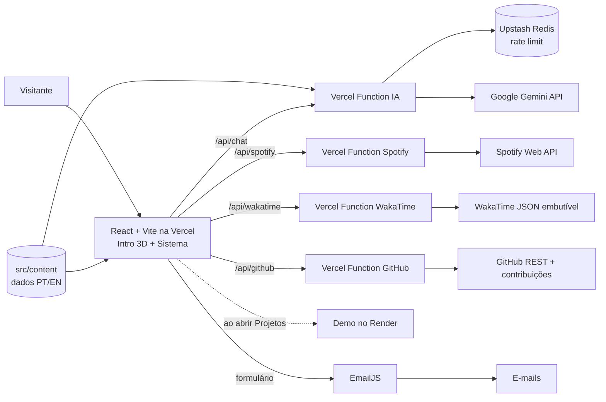

### Rotas

| Rota                         | Comportamento                                                      |
| ---------------------------- | ------------------------------------------------------------------ |
| `/`                          | Redireciona para `/pt` ou `/en` (idioma do navegador; padrão `pt`) |
| `/{locale}`                  | Intro 3D e tela de bloqueio (uma vez por sessão), depois o desktop |
| `/{locale}/{appId}`          | Deep link: pula a intro e abre o sistema com o app em foco         |
| `/{locale}/{appId}` inválido | Janela "App não encontrado" no estilo do sistema                   |
| `/api/chat`                  | `GET`: o assistente está disponível? `POST`: resposta em streaming |
| `/api/spotify`               | `GET`: tocando agora, recentes e top (cache de 30s)                |
| `/api/wakatime`              | `GET`: estatísticas da semana (cache de 1h)                        |
| `/api/github`                | `GET`: contribuições, repositórios e commits (cache de 30 min)     |

Apps (`appId`, iguais nos dois idiomas): `about`, `projects`, `experience`, `skills`, `certificates`, `resume`, `contact`, `music`, `activity`, `github`, `assistant`, `terminal`, `settings`, `system`.

### 🎯 Decisões de design

- **Por que uma mesa 3D?** A primeira impressão de um portfólio dura segundos. A mesa conta quem é o autor antes de qualquer texto (as tecnologias nos livros, o currículo impresso, o time, o anime e o esporte de que ele gosta), e abrir um notebook é um gesto que todo mundo entende. Mostra domínio de 3D e animação sem atrapalhar quem só quer o conteúdo: a intro é pulável, só roda uma vez por sessão e é desligada com movimento reduzido ou sem WebGL.
- **Por que realista?** A primeira versão misturava modelos realistas com objetos de cor chapada e não tinha unidade. Agora tudo segue a mesma regra: materiais de verdade (tecido, cerâmica, vidro, alumínio, palha), luz de uma sala real (HDRI) e uma paleta quente única. Madeira, planta e luminária vêm do Poly Haven (CC0); o resto é código, sem peso extra. Modelos + HDRI somam ~2 MB.
- **Por que uma tela de bloqueio?** Ela faz a ponte entre o 3D e o sistema (a tela do notebook já a mostra antes da câmera chegar, então a troca não tem corte) e é o "olá" do portfólio: foto, nome e cargo antes do desktop.
- **Por que um sistema operacional?** Ele resolve o requisito de navegação de forma natural: a barra de menu é o cabeçalho, o dock é o rodapé, as janelas são o conteúdo e cada seção é um app com endereço próprio. E permite ver várias seções lado a lado, como um recrutador compararia projetos.
- **Por que IA com ferramentas?** Um chatbot que só conversa é mais uma caixa de texto. Com ferramentas, o assistente **age no sistema**: perguntar sobre projetos abre o app Projetos no projeto certo. O prompt é gerado do mesmo conteúdo do site, então ele não inventa dados — e as ferramentas rodam no navegador, sem nenhum poder no servidor.
- **Segredos no servidor:** chaves do Gemini, do Spotify e do Upstash só existem nas funções em `api/` (nunca com prefixo `VITE_`). As do EmailJS são públicas por design e restritas por domínio no painel.

---

## 🎨 Wireframes

Os protótipos de média fidelidade (Figma) ficam em [`docs/wireframes/`](docs/wireframes/): intro, desktop com janela aberta, cada app e a versão mobile.

<!-- TODO(conteúdo): exportar os wireframes do Figma para docs/wireframes/ e exibir aqui, por exemplo:
| Intro | Desktop | Mobile |
| :---: | :---: | :---: |
|  |  |  |
-->

> _Em breve._

---

## 🔧 Instalação e Execução

### Pré-requisitos

- **Node.js:** 22 ou superior (recomendado: 24, definido em `.nvmrc`). O AI SDK 7 exige Node 22+.
- **Gerenciador de pacotes:** npm
- **Git**

### 🔑 Variáveis de Ambiente

Copie o arquivo de exemplo e preencha o que for usar. **Nenhuma variável é obrigatória para rodar o projeto**: o que não estiver configurado aparece como indisponível, sem quebrar nada.

```bash
cp .env.example .env.local
```

| Variável                                                                                                                       | Onde     | Uso                                            |
| :----------------------------------------------------------------------------------------------------------------------------- | :------- | :--------------------------------------------- |
| `GOOGLE_GENERATIVE_AI_API_KEY`                                                                                                 | servidor | Assistente de IA (Google Gemini)               |
| `GEMINI_MODEL`                                                                                                                 | servidor | ID do modelo (vazio = `gemini-3.5-flash-lite`) |
| `UPSTASH_REDIS_REST_URL`, `UPSTASH_REDIS_REST_TOKEN`                                                                           | servidor | Limite de uso do assistente                    |
| `SPOTIFY_CLIENT_ID`, `SPOTIFY_CLIENT_SECRET`, `SPOTIFY_REFRESH_TOKEN`                                                          | servidor | App Música e mini player                       |
| `WAKATIME_LANGUAGES_URL`, `WAKATIME_ACTIVITY_URL`                                                                              | servidor | App Atividade                                  |
| `GITHUB_TOKEN` (opcional)                                                                                                      | servidor | App GitHub: limite maior e gráfico via GraphQL |
| `VITE_EMAILJS_SERVICE_ID`, `VITE_EMAILJS_TEMPLATE_ID_FOR_ME`, `VITE_EMAILJS_TEMPLATE_ID_FOR_SENDER`, `VITE_EMAILJS_PUBLIC_KEY` | cliente  | Formulário de Contato                          |
| `VITE_SITE_URL`                                                                                                                | cliente  | URLs absolutas (Open Graph, sitemap, hreflang) |

> [!IMPORTANT]
> Tudo com prefixo `VITE_` vai para o JavaScript público. As chaves do **Gemini**, do **Spotify**, do **Upstash** e o token do **GitHub** nunca usam esse prefixo: são lidas só pelas funções em `api/`. As do EmailJS são públicas por design — restrinja os domínios permitidos no painel do EmailJS.

### 📦 Instalação de Dependências

```bash
git clone https://github.com/leonardoMartins-Dev/Portifolio-Pessoal.git
cd Portifolio-Pessoal
npm install
```

### ⚡ Como Executar a Aplicação

```bash
npm run dev
```

Abra [http://localhost:5173](http://localhost:5173): você será redirecionado para `/pt` ou `/en` conforme o idioma do navegador. As funções de `api/` rodam junto, lendo o `.env.local`.

| Script                                    | O que faz                                                                     |
| :---------------------------------------- | :---------------------------------------------------------------------------- |
| `npm run dev`                             | Servidor de desenvolvimento (front + `api/`)                                  |
| `npm run build` / `npm run preview`       | Build de produção e servidor para testá-lo                                    |
| `npm run lint`                            | ESLint                                                                        |
| `npm run format` / `npm run format:check` | Formata / confere a formatação (Prettier)                                     |
| `npm test`                                | Testes de unidade (Vitest)                                                    |
| `npm run test:e2e`                        | Testes e2e (Playwright; faz o build antes)                                    |
| `npm run spotify:token`                   | Gera o refresh token do Spotify                                               |
| `npm run screenshots`                     | Gera os prints deste README e a imagem Open Graph (com `npm run dev` rodando) |
| `npm run models`                          | Baixa e prepara os modelos 3D e as HDRIs da intro (Poly Haven)                |

---

## 🧭 Guias de configuração das integrações

### 🤖 Assistente de IA: Google Gemini + Upstash

**Google Gemini (plano gratuito)**

1. Acesse [aistudio.google.com/apikey](https://aistudio.google.com/apikey) com uma conta Google.
2. Clique em **Create API key** e copie a chave (`AIza...`). Não precisa de cartão.
3. Coloque em `GOOGLE_GENERATIVE_AI_API_KEY` (no `.env.local` e nas variáveis de ambiente da Vercel). `GEMINI_MODEL` é opcional: vazio usa `gemini-3.5-flash-lite`.
4. As cotas gratuitas (pedidos por minuto e por dia) aparecem no painel do AI Studio e mudam com o tempo. O limite do próprio site (abaixo) evita que um visitante esgote a cota sozinho.

**Custo:** zero. Sem faturamento ativo no projeto do Google, nada é cobrado: quando a cota acaba, a API responde 429 e o chat mostra "indisponível" até ela renovar. A contrapartida do plano gratuito é que o Google pode usar o conteúdo das conversas para melhorar os produtos dele — por isso o chat avisa para não enviar dados pessoais.

> 💡 **Outros modelos:** `GEMINI_MODEL=gemini-3.8-flash` responde melhor perguntas complexas, mas costuma ter cota gratuita menor. O nível de raciocínio é ajustado sozinho para cada modelo (`server/assistant.js`).

**Upstash Redis (limite de uso)**

1. Acesse [console.upstash.com](https://console.upstash.com/) e crie um banco **Redis** (plano gratuito).
2. Na aba **REST API**, copie `UPSTASH_REDIS_REST_URL` e `UPSTASH_REDIS_REST_TOKEN`.
3. Limites aplicados (§11.3): **15 mensagens a cada 10 minutos por IP** e **500 mensagens por dia** no total.

> Sem o Upstash, em desenvolvimento o limite é pulado (com aviso no console) e em produção usa um limite em memória por instância.

**Como funciona:** `api/chat.js` valida o pedido (só as últimas 10 mensagens, no máximo 500 caracteres por mensagem do visitante), aplica o limite, gera o prompt a partir de `src/content` e responde em streaming com `streamText` (máx. 500 tokens). As ferramentas (`openApp`, `showProject`, `setLanguage`, `setTheme`) são declaradas **sem `execute`** no servidor e executadas no navegador. Este servidor não armazena nem loga o conteúdo das conversas.

### 🎵 Spotify

> [!WARNING]
> Regras de 2026: apps em **Development Mode** exigem que o dono tenha **Spotify Premium** (até 5 usuários — basta o autor). O **refresh token expira 6 meses após a autorização** e renovar o access token não reinicia o prazo: **gere um novo token a cada menos de 6 meses**. Sem Premium, o app Música mostra a playlist do autor (embed oficial).

1. Acesse [developer.spotify.com/dashboard](https://developer.spotify.com/dashboard) e clique em **Create app**.
2. Em **Redirect URIs**, cadastre exatamente `http://127.0.0.1:8888/callback` (o Spotify não aceita `localhost`) e marque **Web API**.
3. Copie o **Client ID** e o **Client Secret** para `SPOTIFY_CLIENT_ID` e `SPOTIFY_CLIENT_SECRET` no `.env.local`.
4. Rode o script e autorize no navegador que abrir:

   ```bash
   npm run spotify:token
   ```

5. Copie o `SPOTIFY_REFRESH_TOKEN` impresso no terminal para o `.env.local` e para a Vercel.
6. (Opcional) Coloque o ID de uma playlist pública sua em `spotifyPlaylistId`, no `src/site.config.js`: é o fallback quando o Spotify não está configurado ou o token expirou.

Escopos usados: `user-read-currently-playing user-read-recently-played user-top-read`. Endpoints: `/me/player/currently-playing`, `/me/player/recently-played` e `/me/top/tracks` (todos mantidos após as mudanças de fev/2026).

### ⏱️ WakaTime

1. Instale o plugin do [WakaTime](https://wakatime.com/plugins) no seu editor **o quanto antes** — o plano gratuito mostra só a última semana.
2. Acesse [wakatime.com/share/embed](https://wakatime.com/share/embed) e crie **dois** embeds, ambos em **formato JSON** e com período **Last 7 Days**:
   - **Coding Activity** → copie a URL para `WAKATIME_ACTIVITY_URL`;
   - **Languages** → copie a URL para `WAKATIME_LANGUAGES_URL`.
3. Pronto: `/api/wakatime` busca os dois JSONs no servidor (eles não têm CORS), normaliza para `{ totalSeconds, dailyAverageSeconds, days, languages }` e guarda em cache por 1h.

### 🐙 GitHub

O app **GitHub** funciona **sem configuração**: o usuário vem de `social.github` no `src/site.config.js`.

- **Repositórios e commits:** API REST pública (`/users/{login}/repos` e `/repos/{login}/{repo}/commits?author={login}`). Os commits vêm dos 4 repositórios com push mais recente, sem merges, porque o evento de push da API pública não traz mais a lista de commits.
- **Gráfico de contribuições:** sem token, vem da página pública do perfil (`github.com/users/{login}/contributions`); com token, da API GraphQL oficial (`contributionsCollection`), com a página pública de reserva.
- `/api/github` junta tudo, guarda em cache por 30 min e, se o GitHub falhar, devolve o último resumo bom.

Sem token, a API REST aceita 60 requisições por hora **por IP**, e na Vercel o IP é compartilhado com outros sites. Para não depender disso em produção:

1. Acesse [github.com/settings/personal-access-tokens](https://github.com/settings/personal-access-tokens) e crie um **fine-grained token** com acesso a **Public repositories** e nenhuma permissão extra.
2. Coloque o token em `GITHUB_TOKEN` no `.env.local` e na Vercel. O limite sobe para 5.000 requisições por hora.

### 📬 EmailJS

Como no guia do professor, cada envio do formulário gera **dois e-mails**: uma notificação para o autor (**FOR ME**) e uma confirmação para quem escreveu (**FOR SENDER**).

1. Crie uma conta em [emailjs.com](https://www.emailjs.com/) (há plano gratuito).
2. Em **Email Services → Add new service**, conecte seu e-mail e copie o **Service ID**.
3. Em **Email Templates**, crie os dois templates abaixo e copie o **Template ID** de cada um:
   - **FOR ME:** no campo **To Email**, coloque o seu e-mail; no **Subject**, `{{title}}`.
   - **FOR SENDER:** no campo **To Email**, coloque `{{email}}`; no **Subject**, `{{title}}`.
4. Em **Account**, copie a **Public Key**.
5. Preencha `VITE_EMAILJS_SERVICE_ID`, `VITE_EMAILJS_TEMPLATE_ID_FOR_ME`, `VITE_EMAILJS_TEMPLATE_ID_FOR_SENDER` e `VITE_EMAILJS_PUBLIC_KEY`.
6. Em **Account → Security**, restrinja os domínios permitidos ao domínio da Vercel e a `localhost`.

Variáveis enviadas aos templates: `{{name}}`, `{{email}}`, `{{message}}`, `{{title}}` (assunto) e `{{time}}` (data/hora no idioma do visitante). O formulário tem validação com Zod, campo _honeypot_ contra robôs e estados de envio, sucesso e erro traduzidos.

#### Template FOR ME

<details>
  <summary>Clique para exibir</summary>

```html
<div
  style="font-family: system-ui, sans-serif, Arial; font-size: 14px; color: #eceef4; max-width: 600px; margin: auto; padding: 2rem; border: 1px solid #2a2c38; border-radius: 14px; background-color: #0e0f14; line-height: 1.6;"
>
  <div style="text-align: center; margin-bottom: 1.5rem;">
    <h2 style="color: #8e97ff; margin-bottom: 0.5rem;">Nova mensagem do Portifólio</h2>
    <p style="color: #a2a7b6; margin: 0;">Alguém escreveu pelo formulário de contato.</p>
  </div>
  <div
    style="padding: 16px; border: 1px solid #2a2c38; border-radius: 10px; background-color: #17181f;"
  >
    <div style="color: #eceef4; font-size: 16px; font-weight: bold;">{{name}}</div>
    <div style="color: #a2a7b6; font-size: 13px;">{{email}} | {{time}}</div>
    <p style="font-size: 15px; color: #eceef4; white-space: pre-wrap;">{{message}}</p>
  </div>
  <p style="margin-top: 20px; text-align: center; font-size: 13px; color: #a2a7b6;">
    Responda direto para {{email}}.
  </p>
</div>
```

</details>

#### Template FOR SENDER

<details>
  <summary>Clique para exibir</summary>

```html
<div
  style="font-family: system-ui, sans-serif, Arial; font-size: 14px; color: #eceef4; max-width: 600px; margin: auto; padding: 2rem; border: 1px solid #2a2c38; border-radius: 14px; background-color: #0e0f14; line-height: 1.6;"
>
  <div style="text-align: center; margin-bottom: 1.5rem;">
    <h2 style="color: #8e97ff; margin-bottom: 0.5rem;">Obrigado pelo contato, {{name}}!</h2>
    <p style="color: #a2a7b6; margin: 0;">Recebi sua mensagem e respondo assim que puder.</p>
  </div>
  <div
    style="padding: 16px; border: 1px solid #2a2c38; border-radius: 10px; background-color: #17181f;"
  >
    <div style="color: #a2a7b6; font-size: 13px;">Sua mensagem ({{time}}):</div>
    <p style="font-size: 15px; color: #eceef4; white-space: pre-wrap;">{{message}}</p>
  </div>
  <p style="margin-top: 20px; text-align: center; font-size: 14px; color: #a2a7b6;">
    Enquanto isso, veja meu
    <a
      href="https://www.linkedin.com/in/leonardomartinsdev/"
      style="color: #8e97ff; text-decoration: none;"
      >LinkedIn</a
    >
    ou meu
    <a href="https://github.com/leonardoMartins-Dev" style="color: #8e97ff; text-decoration: none;"
      >GitHub</a
    >.
  </p>
</div>
```

</details>

---

## 🏅 Como adicionar um certificado

Os certificados ficam em [`src/content/certificates.js`](src/content/certificates.js) e os arquivos em `public/certificates/`. O app **Certificados**, o Terminal (`certificados`) e o assistente leem da mesma lista.

1. Copie o PDF para `public/certificates/`, com um nome curto e sem espaços (ex.: `curso-spring-2026.pdf`).
2. (Opcional) Gere a prévia. No macOS:
   ```bash
   sips -s format png -Z 1200 public/certificates/curso-spring-2026.pdf --out public/certificates/curso-spring-2026.png
   ```
   Sem prévia, o card mostra um selo no lugar da imagem.
3. Acrescente um item na lista. A ordem não importa: o app ordena pela data.
   ```js
   {
     id: 'curso-spring-2026',
     name: 'Nome do curso como está no certificado',
     issuer: 'Quem emitiu',
     date: '2026-11-20', // AAAA-MM-DD
     hours: 10, // opcional
     description: { pt: 'O que o curso cobriu.', en: 'What the course covered.' },
     topics: [{ pt: 'Spring Boot', en: 'Spring Boot' }], // opcional
     file: '/certificates/curso-spring-2026.pdf',
     image: '/certificates/curso-spring-2026.png', // opcional
     credentialUrl: 'https://…', // opcional: o link do QR code, vira "Verificar autenticidade"
   },
   ```
4. Rode `npm test`: ele confere o formato da data e se os arquivos existem em `public/`.

---

## 🚀 Deploy

O deploy é feito na **Vercel**, conectada ao repositório do GitHub. As funções em `api/` viram Vercel Functions automaticamente e o `vercel.json` faz o fallback do SPA (`/qualquer/rota` → `index.html`).

1. Acesse [vercel.com/new](https://vercel.com/new) e entre com a conta do GitHub.
2. Em **Import Git Repository**, escolha este repositório e clique em **Import**. A Vercel detecta o Vite sozinha (build `npm run build`, saída `dist`) — não altere.
3. Em **Environment Variables**, adicione as variáveis do `.env.example` que já tiver. Coloque `VITE_SITE_URL` com a URL de produção (ex.: `https://seu-projeto.vercel.app`).
4. Clique em **Deploy**.

Todo push na `main` gera um deploy de produção e todo Pull Request gera uma **URL de Preview**. Variáveis adicionadas depois só valem a partir do próximo deploy (**Deployments → ⋯ → Redeploy**).

---

## 📂 Estrutura de Pastas

```
.
├── .github/workflows/ci.yml   # 🤖 CI: lint, formatação, testes, build e e2e
├── api/                       # ☁️ Vercel Functions (servidor): chat, spotify, wakatime, github
├── server/                    # 🔒 Código só do servidor: rate limit, Spotify, WakaTime, GitHub, plugins do Vite
├── docs/
│   ├── PROJETO.md             # 📘 Especificação (fonte de verdade)
│   ├── apresentacao.md        # 🎤 Roteiro da apresentação
│   ├── wireframes/            # 🎨 Protótipos exportados do Figma
│   └── screenshots/           # 🖼️ Prints deste README (npm run screenshots)
├── public/                    # 📁 Estáticos: brand (logo, OG), certificates, cv, hdri, images, models (3D), projects, wallpapers
├── scripts/                   # 🛠️ spotify-token.mjs, screenshots.mjs, fetch-models.mjs
├── src/
│   ├── components/
│   │   ├── intro/             # 💻 Mesa 3D (desk/: um arquivo por objeto), notebook, textura da tela, sequência GSAP
│   │   ├── os/                # 🪟 Shell: barra de menu, dock, janelas, desktop, mobile, lançador, tela de bloqueio
│   │   ├── apps/              # 🧩 Um componente por app (Sobre, Projetos, …)
│   │   ├── chat/              # 🤖 Painel do assistente e markdown
│   │   └── ui/                # 🎛️ Botões, chips, ícones, estados vazios
│   ├── content/               # 🗂️ Perfil, projetos, experiências, skills e certificados (PT/EN)
│   ├── i18n/                  # 🌐 i18next e mensagens pt.json / en.json
│   ├── lib/                   # ⚙️ Registro de apps, store, assistente, Terminal, formatação…
│   ├── styles/globals.css     # 🎨 Tokens de tema e estilos globais
│   ├── site.config.js         # 🧾 Identidade do site (nome, cor, redes, playlist)
│   ├── App.jsx                # 🧭 Rotas
│   └── main.jsx               # 🚪 Entrada
├── tests/
│   ├── unit/                  # 🧪 Vitest
│   └── e2e/                   # 🎭 Playwright
├── .env.example               # 🧩 Todas as variáveis, sem valores
├── CLAUDE.md                  # 🤖 Guia para o agente de código
├── vercel.json                # ▲ Fallback do SPA e configuração das funções
└── vite.config.js             # ⚡ Vite + Tailwind + plugins (api local, SEO) + Vitest
```

---

## 🎥 Demonstração

> [!NOTE]
> Prints com o conteúdo provisório (`TODO(conteúdo)`); são gerados de novo com `npm run screenshots` depois que o conteúdo real entrar.

### 🌐 Aplicação Web

|                                                                            Intro 3D: a mesa à noite (tema escuro)                                                                            |                                                      A mesma mesa de dia (tema claro)                                                      |
| :------------------------------------------------------------------------------------------------------------------------------------------------------------------------------------------: | :----------------------------------------------------------------------------------------------------------------------------------------: |
| 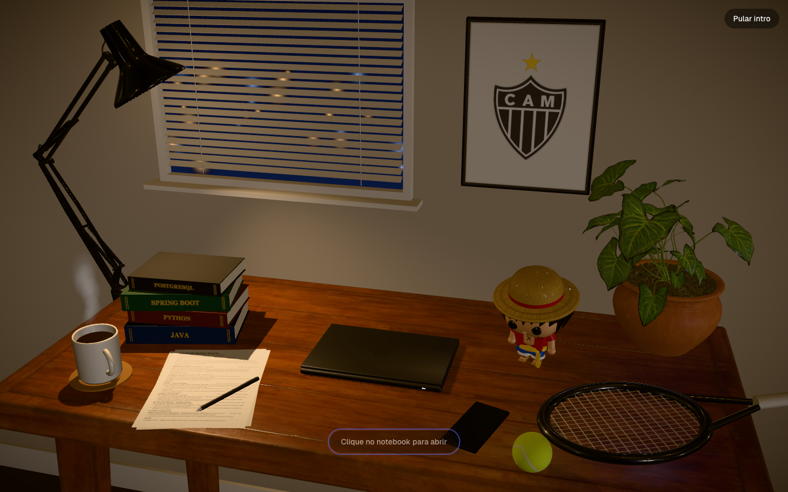 |                 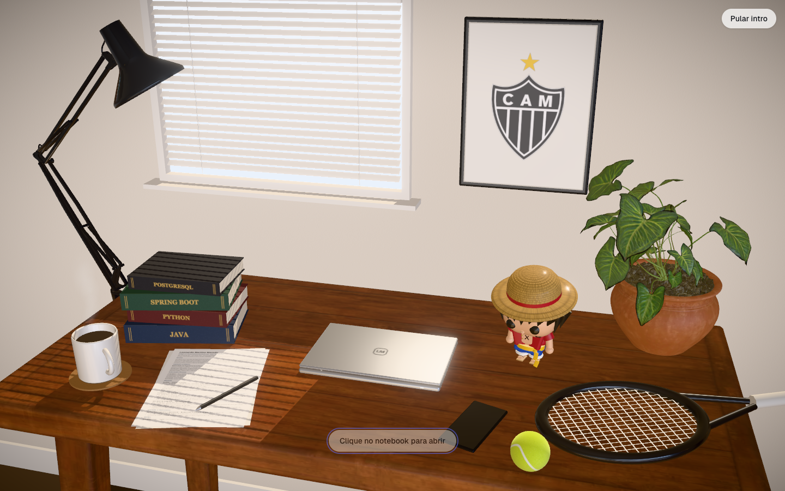                 |
|                                                                                     **Notebook abrindo**                                                                                     |                                                            **Tela de bloqueio**                                                            |
|                                                        | 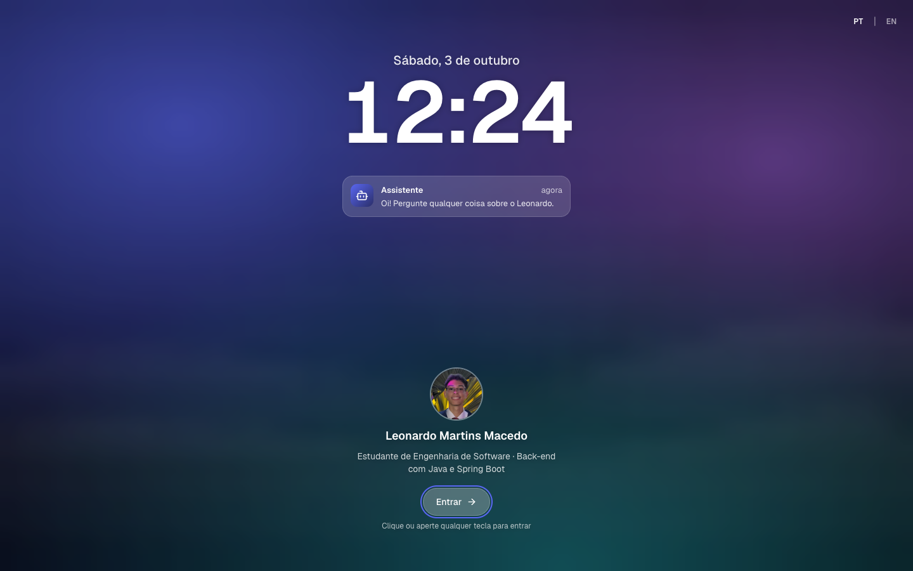 |
|                                                                            **Desktop com janelas (tema escuro)**                                                                             |                                                          **Ajustes (tema claro)**                                                          |
|                                              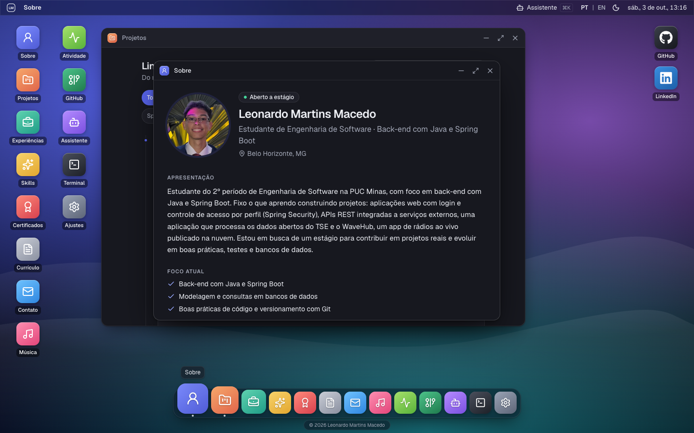                                              |                         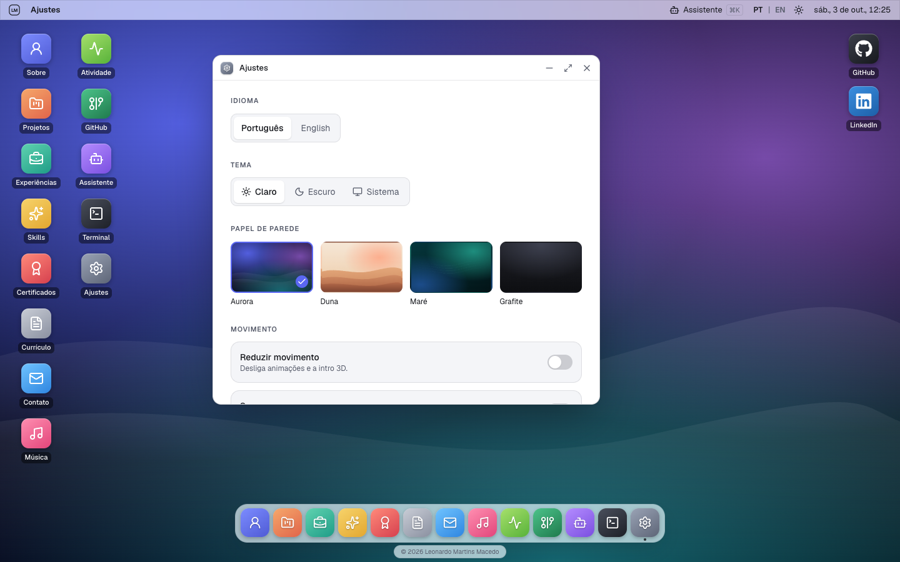                         |
|                                                                                         **Terminal**                                                                                         |                                                            **Contato (inglês)**                                                            |
|                                           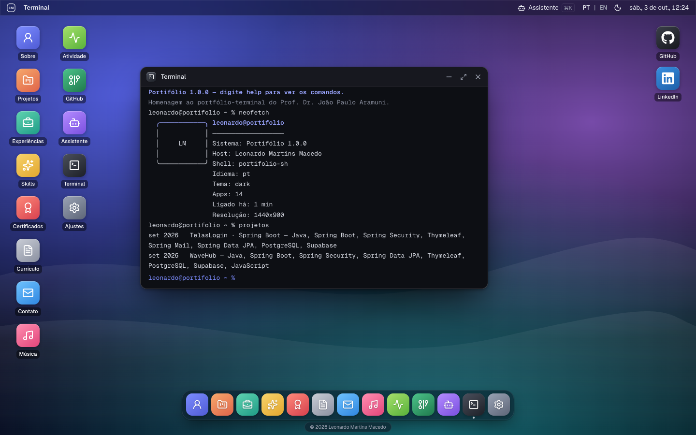                                            |                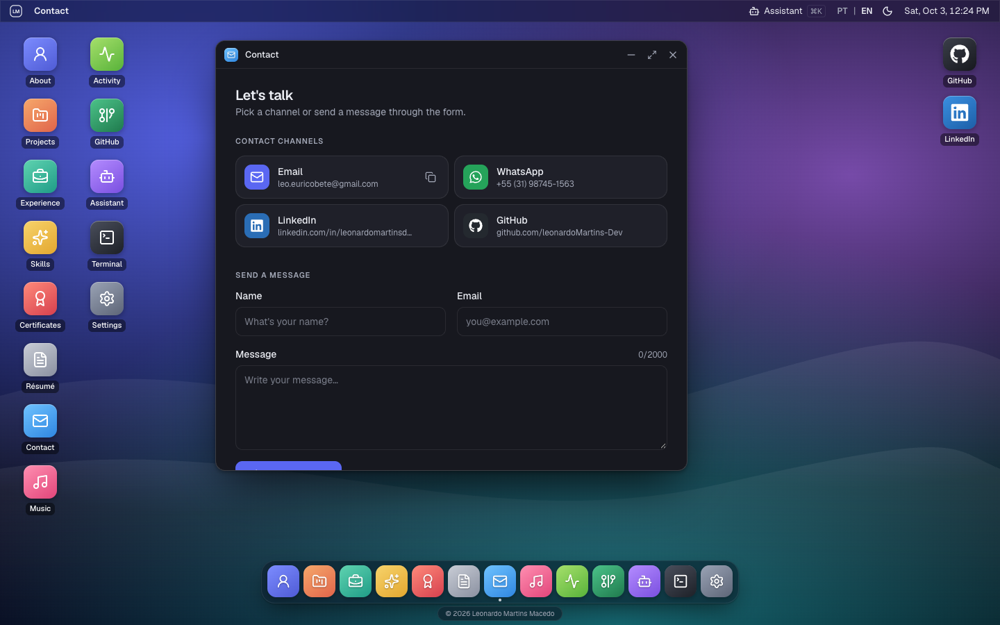                 |
|                                                                                      **GitHub ao vivo**                                                                                      |                                                         **Sobre: fora do código**                                                          |
|                    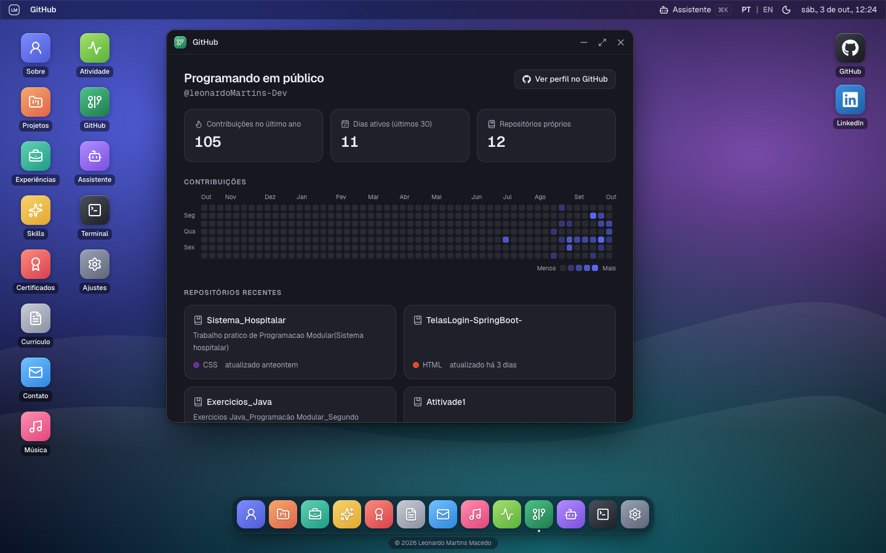                    | 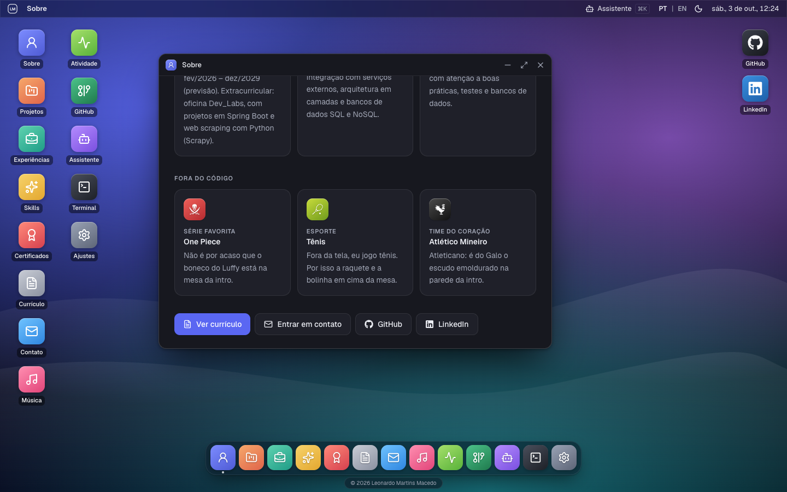 |

### 📱 Celular

|                                                       Tela inicial                                                       |                                             App em tela cheia                                             |
| :----------------------------------------------------------------------------------------------------------------------: | :-------------------------------------------------------------------------------------------------------: |
| 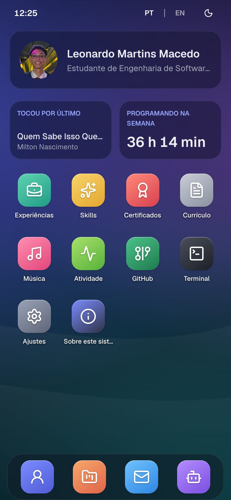 | 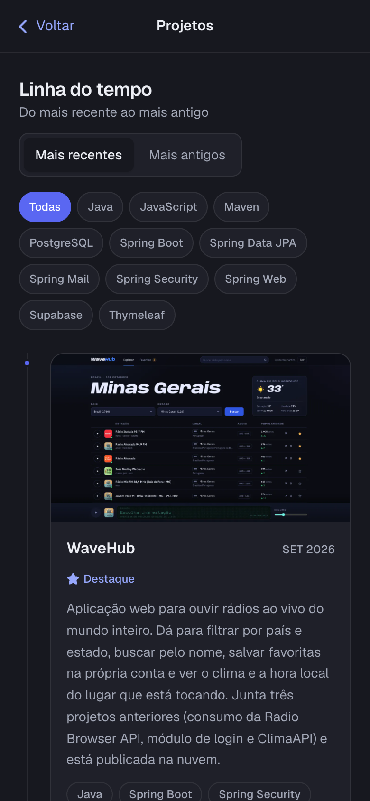 |

---

## 🧪 Testes

### Testes de Unidade

```bash
npm test
```

_Ferramentas: Vitest + Testing Library._ Cobrem (§15): store de janelas (abrir, focar, minimizar, maximizar, fechar, limites), ordenação da timeline e dos certificados (com os arquivos de cada um existindo em `public/`), schema do formulário, gerador do prompt do assistente (contém todos os projetos e apps, nenhuma variável de ambiente, < 6 mil tokens), paridade de chaves do i18n, parser e comandos do Terminal, enquadramento _cover_ da intro nos 4 viewports do critério de aceite, normalização do Spotify e do WakaTime, resumo do GitHub (repositórios, commits, gráfico pela página pública e pela GraphQL, falhas parciais) e o gráfico em semanas, despertar da demo (sem CORS, uma vez a cada 10 min), validação do pedido ao `/api/chat`, rate limit e componentes (timeline, validação do Contato, carregamento de cada app).

### Testes End-to-End (E2E)

```bash
npx playwright install chromium   # uma vez
npm run test:e2e
```

_Ferramenta: Playwright_ (contra o build de produção). **Desktop:** pular a intro, abrir cada app pelo dock, trocar o idioma mantendo o app, deep link e 404, minimizar/maximizar/fechar com Esc, validação do formulário, assistente com a API simulada (responde e abre o app pedido), app GitHub com a API simulada, abrir Projetos acorda a demo do WaveHub e Terminal. **Celular (375px):** abrir um app em tela cheia e voltar, Voltar do navegador fecha o app e nada de rolagem horizontal.

---

## 🔗 Documentações utilizadas

- 📖 [**React**](https://react.dev/reference/react) e [**React Router**](https://reactrouter.com/)
- 📖 [**Vite**](https://vite.dev/guide/) e [**Vercel Functions**](https://vercel.com/docs/functions)
- 📖 [**React Three Fiber**](https://r3f.docs.pmnd.rs/) · [**drei**](https://drei.docs.pmnd.rs/) · [**GSAP**](https://gsap.com/docs/v3/)
- 📖 [**AI SDK**](https://ai-sdk.dev/) — chatbot com ferramentas no cliente
- 📖 [**Spotify Web API**](https://developer.spotify.com/documentation/web-api) — [mudanças de fev/2026](https://developer.spotify.com/documentation/web-api/references/changes/february-2026) e [expiração de refresh tokens](https://developer.spotify.com/blog/2026-06-18-refresh-token-expiration)
- 📖 [**GitHub REST API**](https://docs.github.com/rest) e [**GraphQL**](https://docs.github.com/graphql) — [mudanças no payload dos eventos](https://github.blog/changelog/2025-08-08-upcoming-changes-to-github-events-api-payloads/)
- 📖 [**WakaTime**](https://wakatime.com/developers) · [**EmailJS**](https://www.emailjs.com/docs/) · [**Upstash Ratelimit**](https://upstash.com/docs/redis/sdks/ratelimit-ts/overview)
- 📖 [**i18next**](https://www.i18next.com/) · [**Zustand**](https://zustand.docs.pmnd.rs/) · [**Motion**](https://motion.dev/) · [**Tailwind CSS**](https://tailwindcss.com/docs)
- 📖 [**Vitest**](https://vitest.dev/guide/) · [**Testing Library**](https://testing-library.com/docs/react-testing-library/intro/) · [**Playwright**](https://playwright.dev/)
- 📖 [**Conventional Commits**](https://www.conventionalcommits.org/pt-br/v1.0.0/)
- 📖 [**Template de README do professor**](https://github.com/joaopauloaramuni/desenvolvimento-e-integracao-de-aplicacoes-web/blob/main/TEMPLATES/template_README.md)

---

## 👥 Autores

| 👤 Nome                 | 🖼️ Foto                                                                                                     | :octocat: GitHub                                                                                                                                                           | 💼 LinkedIn                                                                                                                                                                           | 📤 Gmail                                                                                                                                                           |
| ----------------------- | ----------------------------------------------------------------------------------------------------------- | -------------------------------------------------------------------------------------------------------------------------------------------------------------------------- | ------------------------------------------------------------------------------------------------------------------------------------------------------------------------------------- | ------------------------------------------------------------------------------------------------------------------------------------------------------------------ |
| Leonardo Martins Macedo | <div align="center"></div> | <div align="center"><a href="https://github.com/leonardoMartins-Dev"></a></div> | <div align="center"><a href="https://www.linkedin.com/in/leonardomartinsdev/"></a></div> | <div align="center"><a href="mailto:leo.euricobete@gmail.com"></a></div> |

---

## 🤝 Contribuição

1. Faça um `fork` do projeto.
2. Crie uma branch para sua feature (`git checkout -b feat/minha-feature`).
3. Faça commit das mudanças (`git commit -m 'feat: adiciona nova funcionalidade X'`), seguindo o padrão [Conventional Commits](https://www.conventionalcommits.org/pt-br/v1.0.0/).
4. Faça o `push` para a branch (`git push origin feat/minha-feature`).
5. Abra um **Pull Request** — o CI roda lint, formatação, testes, build e e2e.

---

## 🙏 Agradecimentos

- [**Engenharia de Software PUC Minas**](https://www.instagram.com/engsoftwarepucminas/) — pela estrutura acadêmica e pelo incentivo às boas práticas de engenharia.
- [**Prof. Dr. João Paulo Aramuni**](https://github.com/joaopauloaramuni) — pela disciplina, pelo template deste README e pelo portfólio em estilo terminal ([aramuni.dev](https://aramuni.dev/)), homenageado no app **Terminal** deste sistema.
- [**Poly Haven**](https://polyhaven.com/) — mesa, luminária e planta da intro 3D e as HDRIs `wooden_lounge` e `lebombo` usadas na iluminação ([CC0](https://polyhaven.com/license)).
- Escudo do **Clube Atlético Mineiro** ([Wikimedia Commons](https://commons.wikimedia.org/wiki/File:Clube_Atl%C3%A9tico_Mineiro_logo.svg)) e personagem **Luffy** (_One Piece_, de Eiichiro Oda; o boneco é feito em código, inspirado no estilo dos bonecos da Funko) aparecem só como decoração pessoal da mesa 3D; pertencem aos seus donos.

---

## 📄 Licença

Este projeto é distribuído sob a **[Licença MIT](LICENSE)**.
